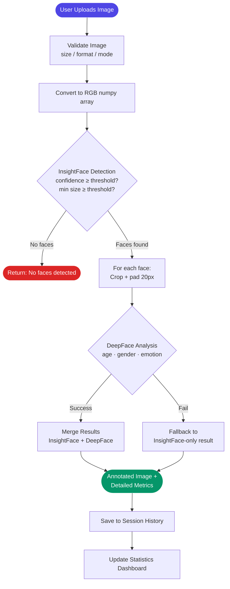

# 👥 Age & Gender Detection System

<!-- BADGES -->


> **One-liner:** A production-ready AI-powered face analysis system that detects faces and predicts age, gender, and emotions in real-time using InsightFace + DeepFace.

---

## 📌 Table of Contents

- [The Problem](#-the-problem)
- [Our Solution & Purpose](#-our-solution--purpose)
- [Why This Over Others](#-why-this-over-others)
- [Tech Stack](#-tech-stack)
- [System Flow](#-system-flow)
- [File Structure](#-file-structure)
- [Prerequisites](#-prerequisites)
- [Installation & Setup](#-installation--setup)
- [Usage](#-usage)
- [Configuration](#-configuration)
- [Contribution Guidelines](#-contribution-guidelines)
- [Known Limitations & Roadmap](#-known-limitations--roadmap)
- [License](#-license)

---

## 🚨 The Problem

Manually estimating age, gender, and emotion from faces is slow, subjective, and doesn't scale. Existing face analysis tools are either too slow for real-time use (pure DeepFace), lack emotion recognition (pure InsightFace), or are locked behind paid APIs with no offline capability.

**Key pain points:**
- ❌ Single-model solutions sacrifice either speed or accuracy
- ❌ No offline-capable dual-model comparison in a single tool
- ❌ No unified dashboard to track demographics across analysis sessions

---

## 🎯 Our Solution & Purpose

**Age & Gender Detection System** is an open-source, offline-capable face analysis application that fuses **InsightFace** (fast detection) with **DeepFace** (detailed attribute analysis), designed for developers, researchers, and hobbyists who need accurate demographic analysis without cloud dependency.

It solves the above by:
1. **Dual-Model Pipeline** — InsightFace handles rapid face detection; DeepFace refines each face for age, gender, and emotion
2. **Real-Time Ready** — Optimized inference (CPU ~1–3s, GPU ~0.5–1s per image) with adjustable confidence thresholds
3. **Built-in Analytics** — Session-persistent history with age/gender/emotion distribution charts

---

## ⚡ Why This Over Others

| Feature | This Project | DeepFace Standalone | InsightFace Standalone |
|---|:---:|:---:|:---:|
| Face Detection Speed | ✅ Fast (~100ms) | ❌ Slow | ✅ Fast |
| Emotion Recognition | ✅ 7 emotions | ✅ Yes | ❌ No |
| Dual-Model Validation | ✅ Both results shown | ❌ Single model | ❌ Single model |
| Statistics Dashboard | ✅ Built-in | ❌ Manual | ❌ Manual |
| GPU Acceleration | ✅ CUDA | ✅ CUDA | ✅ CUDA |
| Offline / No API Key | ✅ Fully offline | ✅ Offline | ✅ Offline |
| Open Source | ✅ MIT | ✅ MIT | ✅ MIT |

> 💡 **The bottom line:** The only tool that gives you both models' outputs side-by-side with a live dashboard — no cloud dependency, no API costs.

---

## 🛠 Tech Stack

### Frontend
| Technology | Version | Purpose |
|---|---|---|
| Streamlit | 1.28.x | Web UI framework (Python-based, no JS needed) |
| Plotly | 5.x | Interactive charts (age/gender/emotion distributions) |
| Pandas | 1.x | Data manipulation for statistics |

### ML & Computer Vision
| Technology | Version | Purpose |
|---|---|---|
| InsightFace | 0.7.x | Face detection + base age/gender (ResNet CNN, ~100ms) |
| DeepFace | 0.0.79 | Refined age, gender, emotion (VGG-Face backend) |
| OpenCV | 4.8.x | Image processing and annotation rendering |
| TensorFlow | 2.15.x | DeepFace model runtime |
| ONNX Runtime | 1.15+ | InsightFace model inference |

### Infrastructure
| Technology | Version | Purpose |
|---|---|---|
| Python | 3.9+ | Runtime |
| pip | — | Package management |

---

## 🔄 System Flow



### Flow Explanation

| Step | Description |
|---|---|
| **Validation** | Checks file format (jpg/png/bmp/tiff), dimensions (50–5000px), and color mode (RGB/RGBA/L) |
| **InsightFace** | Runs face detection at configurable confidence threshold; returns bounding boxes, base age, and gender |
| **DeepFace** | Each detected face is cropped with 20px padding and analyzed for refined age, gender, and 7-class emotion |
| **Merge** | DeepFace values preferred; InsightFace used as fallback if DeepFace fails. Both displayed in dual-model mode |
| **Display** | Annotated image drawn with OpenCV + per-face expandable detail panels + Plotly emotion bar charts |

---

## 📁 File Structure

```
project-root/
│
├── src/                            # Application source code
│   ├── __init__.py
│   ├── models.py                   # Enums (Gender, AgeGroup, Emotion) + typed dataclasses (BBox, AnalysisResult, …)
│   ├── config.py                   # Settings dataclass with env-variable overrides
│   ├── analyzer.py                 # Pure AgeGenderAnalyzer — detection, DeepFace refinement, pipeline orchestration
│   ├── image.py                    # Image validation, color conversion, resize, annotation drawing
│   └── ui.py                       # Streamlit UI — layout, session state, sidebar controls, tabs
│
├── tests/                          # Test suites
│   ├── __init__.py
│   ├── conftest.py                 # Shared fixtures (sample results, images)
│   ├── test_models.py              # AgeGroup boundaries, BBox math, enum string representations
│   ├── test_image.py               # Validation, color space, resize, annotation drawing
│   └── test_analyzer.py            # Init states, classify_age_group, stats calculation, format_time
│
├── .streamlit/
│   └── config.toml                 # Streamlit theme, server, and caching configuration
│
├── .gitignore
├── pyproject.toml                  # Packaging, ruff linting, mypy, pytest configuration
├── requirements.txt                # Python dependency manifest
├── README.md
└── LICENSE
```

---

## 🧰 Prerequisites

Ensure the following are installed on your system before proceeding:

| Requirement | Minimum Version | Check Command | Download |
|---|---|---|---|
| Python | 3.9+ | `python --version` | [python.org](https://python.org) |
| pip | 21+ | `pip --version` | Bundled with Python |
| Git | 2.x | `git --version` | [git-scm.com](https://git-scm.com) |

> ⚠️ **OS Compatibility:** Tested on macOS 14+, Ubuntu 22.04+, Windows 11 (WSL2 recommended).

---

## 🚀 Installation & Setup

### 1. Clone the Repository

```bash
git clone https://github.com/MNADITYA05/Age-Gender-Detection-System.git
cd Age-Gender-Detection-System
```

### 2. Create Virtual Environment (Recommended)

```bash
python -m venv .venv
source .venv/bin/activate   # On Windows: .venv\Scripts\activate
```

### 3. Install Dependencies

```bash
pip install -r requirements.txt
```

### 4. Run the Application

```bash
streamlit run src/ui.py
```

### 5. Verify

```
✅ Server running at: http://localhost:8501
✅ AI models loaded (InsightFace + DeepFace)
```

> 🐳 **Docker:** Not currently available — run natively via `pip install`.

---

## 💡 Usage

### Quick Start

1. Open `http://localhost:8501` in your browser
2. Upload an image or capture one via camera
3. Adjust detection confidence / min face size in the sidebar
4. View annotated results with per-face age, gender, and emotion
5. Switch to the **Statistics** tab to see demographic distributions

### Common Commands

| Command | Description |
|---|---|
| `streamlit run src/ui.py` | Start the application |
| `python -m pytest tests/ -v` | Run all test suites |
| `pip install -e ".[dev]"` | Install with dev dependencies (pytest, ruff, mypy) |

---

## ⚙️ Configuration

All settings are defined in `src/config.py` via a `Settings` dataclass. Values can be overridden with environment variables.

| Variable | Default | Description |
|---|---|---|
| `ENABLE_GPU` | `true` | Use CUDA GPU acceleration if available |
| `DETECTION_CONFIDENCE` | `0.5` | Face detection confidence threshold (0.1–1.0) |
| `MIN_FACE_SIZE` | `30` | Minimum face dimension in pixels |
| `LOG_LEVEL` | `"INFO"` | Python logging level |
| `DEBUG_MODE` | `false` | Enable verbose debug logging |

Detection parameters (confidence, min size) are also adjustable per-session via the Streamlit sidebar without restarting.

---

## 🤝 Contribution Guidelines

We welcome contributions of all kinds — bug fixes, features, docs, and more.

### Getting Started

1. **Fork** the repository
2. **Create** a branch from `main`:
   ```bash
   git checkout -b feat/your-feature-name
   ```
3. **Make** changes with clear, atomic commits
4. **Push** to your fork and open a Pull Request

### Branch Naming Convention

| Type | Pattern | Example |
|---|---|---|
| New feature | `feat/[short-description]` | `feat/ethnicity-detection` |
| Bug fix | `fix/[short-description]` | `fix/rgba-conversion-crash` |
| Documentation | `docs/[short-description]` | `docs/api-reference` |
| Refactor | `refactor/[short-description]` | `refactor/analyzer-pipeline` |

### Commit Message Format

Follow [Conventional Commits](https://www.conventionalcommits.org/):

```
type(scope): short description
```

### Pull Request Checklist

- [ ] Code follows project style (`ruff check src/`)
- [ ] All tests pass (`pytest tests/`)
- [ ] New functionality includes tests
- [ ] Documentation updated if needed

> 💬 For major changes, open an issue first to discuss the approach.

---

## 🛤 Known Limitations & Roadmap

### Current Limitations

- ⚠️ **Batch processing** — DeepFace runs per-face sequentially; no batched inference
- ⚠️ **Single-image only** — No video stream or webcam real-time mode (only single camera capture)
- ⚠️ **Memory** — TensorFlow + ONNX runtimes consume ~2GB RAM
- ⚠️ **Emotion scores** — Domain percentages (0–100) from DeepFace, not true probabilities

### Roadmap

| Status | Milestone | Target |
|:---:|---|---|
| ✅ Done | Core dual-model pipeline (InsightFace + DeepFace) | v1.0 |
| ✅ Done | Statistics dashboard with history | v1.0 |
| ✅ Done | Typed dataclasses + pure analyzer (streamlit-decoupled) | v1.0 |
| ✅ Done | Test suite (32 tests) | v1.0 |
| 🔄 In Progress | CUDA auto-detection and fallback | v1.1 |
| 📋 Planned | Batch/multi-image upload | v1.1 |
| 📋 Planned | Video stream analysis | v2.0 |
| 💡 Exploring | Ethnicity and attractiveness estimation | Future |

---

## 📄 License

This project is licensed under the **MIT License**. See the [LICENSE](./LICENSE) file for full details.

---

## 🙏 Acknowledgments

- **InsightFace** — Face detection and analysis framework ([GitHub](https://github.com/deepinsight/insightface))
- **DeepFace** — Advanced facial attribute analysis ([GitHub](https://github.com/serengil/deepface))
- **Streamlit** — Interactive web application framework ([streamlit.io](https://streamlit.io))
- **OpenCV** — Computer vision and image processing ([opencv.org](https://opencv.org))

---

<div align="center">

Built with ❤️ by [MNADITYA05](https://github.com/MNADITYA05)

[⭐ Star this repo](https://github.com/MNADITYA05/Age-Gender-Detection-System) · [🐛 Report a Bug](https://github.com/MNADITYA05/Age-Gender-Detection-System/issues) · [💡 Request a Feature](https://github.com/MNADITYA05/Age-Gender-Detection-System/issues)

</div>
